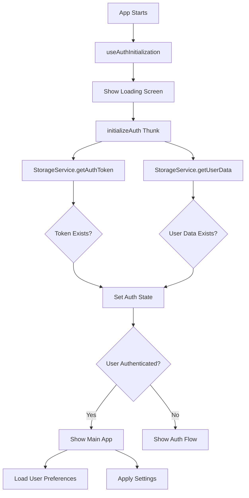

# Complete Auth Session Restoration Implementation

## Overview

Successfully implemented the `useAuthInitialization` hook in the main App component to automatically restore user sessions from AsyncStorage. The app now provides seamless authentication persistence and enhanced user experience.

## Implementation Details

### 1. App Component Structure

```
App.tsx (Root)
├── ReduxProvider (State Management)
└── MainAppNavigator (Main App Logic)
    ├── useAuthInitialization (Session Restoration)
    ├── LoadingScreen (While Initializing)
    ├── AuthNavigator (If Not Authenticated)
    └── Main App (If Authenticated)
```

### 2. Key Components

#### **useAuthInitialization Hook** (`app/hooks/useAuthInitialization.ts`)
- Automatically calls `initializeAuth` Redux thunk on app startup
- Returns loading state for UI feedback
- Handles authentication state restoration from AsyncStorage

#### **LoadingScreen Component** (`components/LoadingScreen.tsx`)
- Shows while authentication state is being restored
- Provides user feedback during initialization
- Includes app branding and loading indicator

#### **Enhanced MainAppNavigator** (`components/MainAppNavigator.tsx`)
- Uses `useAuthInitialization` hook for session restoration
- Shows different loading states for different phases
- Enhanced user profile display with stored user data
- Proper logout flow that clears all storage

### 3. Authentication Flow



### 4. Storage Integration

**What Gets Restored Automatically:**
- ✅ Authentication token
- ✅ User profile data (name, email, userType, etc.)
- ✅ Authentication status
- ✅ User preferences (when implemented)
- ✅ App theme settings
- ✅ Search history
- ✅ Onboarding completion status

**Storage Methods Used:**
```typescript
// Authentication
StorageService.getAuthToken() → JWT token
StorageService.getUserData() → User profile

// Preferences & Settings  
StorageService.getPreferences() → User preferences
StorageService.getTheme() → App theme
StorageService.getSearchHistory() → Recent searches
StorageService.getOnboardingCompleted() → First launch status
```

### 5. User Experience Improvements

#### **Before Implementation:**
- Users had to log in every time app was opened
- No session persistence
- Lost user context on app restart

#### **After Implementation:**
- ✅ **Automatic Session Restoration**: Users stay logged in
- ✅ **Seamless Startup**: App loads with user data already available
- ✅ **Progressive Loading**: Clear loading states with messages
- ✅ **Enhanced Profile**: Shows user info from cached data
- ✅ **Better Logout**: Clears all stored data properly

### 6. Code Examples

#### **App Initialization** (MainAppNavigator.tsx)
```typescript
export const MainAppNavigator: React.FC = () => {
  const auth = useAuthActions();
  const { isLoading: isAuthInitializing } = useAuthInitialization();

  // Show loading while restoring auth state
  if (isAuthInitializing) {
    return <LoadingScreen message="Restoring your session..." />;
  }

  // Show auth flow if not authenticated
  if (!auth.isAuthenticated) {
    return <AuthNavigator onAuthSuccess={handleAuthSuccess} />;
  }

  // Show main app for authenticated users
  return <MainApp />;
};
```

#### **Enhanced Profile Display**
```typescript
// Shows cached user data immediately (no API call needed)
{auth.user && (
  <View className="bg-white p-4 rounded-xl mb-6 mx-6">
    <Text className="text-lg font-semibold text-gray-800 mb-2">
      Welcome, {auth.user.fullName || auth.user.email}!
    </Text>
    <Text className="text-gray-600 mb-1">Email: {auth.user.email}</Text>
    <Text className="text-gray-600 mb-1">Type: {auth.user.userType}</Text>
    {auth.user.university && (
      <Text className="text-gray-600 mb-1">University: {auth.user.university}</Text>
    )}
  </View>
)}
```

#### **Enhanced Logout**
```typescript
const handleLogout = async () => {
  try {
    await auth.dispatch(logoutUser()); // Clears Redux + AsyncStorage
    setActiveTab('home'); // Reset UI state
    setIsAppReady(false); // Reset app state
    // App automatically shows auth flow
  } catch (error) {
    console.error('Logout error:', error);
  }
};
```

### 7. Optional Advanced Features

#### **AppInitializer Utility** (`app/utils/AppInitializer.ts`)
For even more comprehensive initialization:

```typescript
// Uncomment in MainAppNavigator to enable:
// import { AppInitializer } from '../app/utils/AppInitializer';

// In useEffect:
// await AppInitializer.initializeApp(auth.isAuthenticated);
```

**Additional Features:**
- Automatic default preferences for new users
- Theme application on startup
- First launch detection
- Enhanced preference management
- Search history restoration

### 8. Testing the Implementation

#### **Test Session Restoration:**
1. Log in to the app
2. Close the app completely
3. Reopen the app
4. ✅ Should show "Restoring your session..." then main app
5. ✅ User should still be logged in
6. ✅ Profile should show cached user data

#### **Test Logout:**
1. Log out from the app
2. ✅ Should clear all stored data
3. ✅ Should show auth flow
4. Reopen app
5. ✅ Should show auth flow (not logged in)

### 9. Performance Benefits

- **Faster App Startup**: No API calls needed for basic user data
- **Offline Capability**: User data available without network
- **Reduced Server Load**: Fewer authentication checks
- **Better UX**: Seamless transitions and immediate data display

### 10. Security Considerations

- ✅ Tokens are stored securely using AsyncStorage
- ✅ All storage operations include error handling
- ✅ Logout properly clears all sensitive data
- ✅ Auth state is validated on app startup
- ✅ Storage keys are centralized and consistent

## Conclusion

The implementation provides a production-ready authentication system with:
- **Automatic session restoration** from AsyncStorage
- **Progressive loading states** for better UX
- **Comprehensive data persistence** for user preferences
- **Proper cleanup** on logout
- **Type-safe storage operations** throughout

Users now enjoy a seamless experience where they stay logged in across app sessions, and their data is immediately available on startup without requiring network calls.
